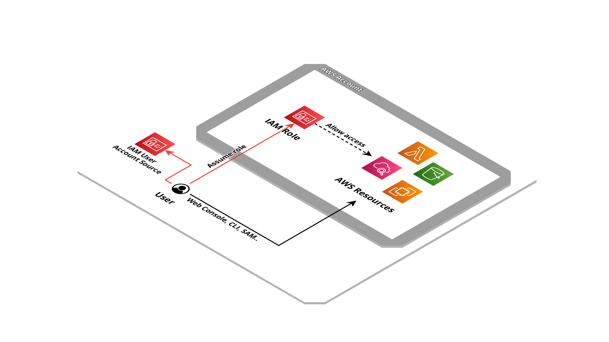

# IAM Role for cross account access


Create a rule to be used through the account [switch role](https://docs.aws.amazon.com/IAM/latest/UserGuide/id_roles_use_switch-role-console.html).

## Created resources

Create a IAM role with administrator permissions to allow access user from an other account.



## Installation

| Region       | Deploy Link |
| ------------ | ----------- |
| eu-west-1    | [](https://eu-west-1.console.aws.amazon.com/cloudformation/home#/stacks/create/review?templateURL=https://bitbull-serverless-templates-butoamoogh8eigo.s3.eu-west-1.amazonaws.com/iam-role-cross-account-access/template.yml&stackName=accessrole) |
| eu-central-1 | [](https://eu-central-1.console.aws.amazon.com/cloudformation/home#/stacks/create/review?templateURL=https://bitbull-serverless-templates-saijuozaeshae6e.s3.eu-central-1.amazonaws.com/iam-role-cross-account-access/template.yml&stackName=accessrole) |
| us-east-1    | [](https://us-east-1.console.aws.amazon.com/cloudformation/home#/stacks/create/review?templateURL=https://bitbull-serverless-templates-chai7ephae5eet2.s3.us-east-1.amazonaws.com/iam-role-cross-account-access/template.yml&stackName=accessrole) |
| us-east-2    | [](https://us-east-2.console.aws.amazon.com/cloudformation/home#/stacks/create/review?templateURL=https://bitbull-serverless-templates-xae9och1eipiem8.s3.us-east-2.amazonaws.com/iam-role-cross-account-access/template.yml&stackName=accessrole) |

Using the [SAM CLI](https://docs.aws.amazon.com/serverless-application-model/latest/developerguide/what-is-sam.html):
```bash
sam build
sam deploy --guided
```

Including in an other SAM template:
```yaml
AWSTemplateFormatVersion: '2010-09-09'
Transform: AWS::Serverless-2016-10-31

Resources:
  RoleAccountAccess:
    Type: AWS::CloudFormation::Stack
    Properties:
      TemplateURL: # pick a templates links from section below, based on your region
      Parameters:
        RoleIdentifier: "CompanyName"
        AccountId: 123456789012
```

## Public templates

| Region       | Template URLs                                                                                           |
| ------------ | ------------------------------------------------------------------------------------------------------- |
| eu-west-1    | https://bitbull-serverless-templates-butoamoogh8eigo.s3.eu-west-1.amazonaws.com/iam-role-cross-account-access/template.yml    |
| eu-central-1 | https://bitbull-serverless-templates-saijuozaeshae6e.s3.eu-central-1.amazonaws.com/iam-role-cross-account-access/template.yml |
| us-east-1    | https://bitbull-serverless-templates-chai7ephae5eet2.s3.us-east-1.amazonaws.com/iam-role-cross-account-access/template.yml    |
| us-east-2    | https://bitbull-serverless-templates-xae9och1eipiem8.s3.us-east-2.amazonaws.com/iam-role-cross-account-access/template.yml    |

## Parameters

This application need some parameters when you deploy it:

- **RoleIdentifier**: Identifier appended to the end of the name of the role.

- **AccountId**: The ID of the AWS account to be granted access.

## Outputs

- **RoleArn**: The ARN of the created access rule, to be communicated to whoever is to connect.

## Credits

- Repository badges by [Shields.io](https://shields.io/)
- Infrastructure schema by [Cloudcraft](https://www.cloudcraft.co/)
